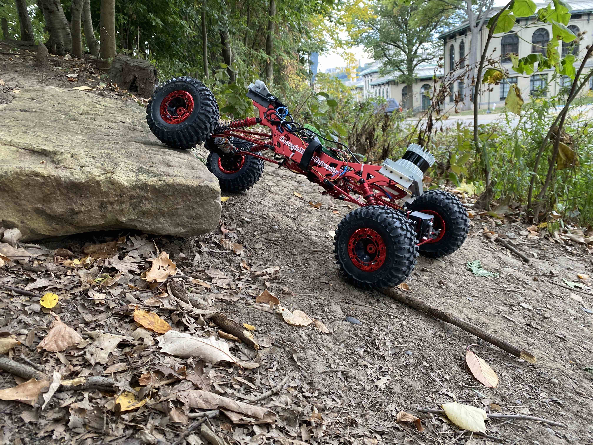

# Clifford Gazebo Simulation
Gazebo simulation package for livox running on Clifford Wheeled robots

## Requirements
- ROS(=Noetic)
- Gazebo (= 11.x, http://gazebosim.org/)
- Ubuntu(=20.04)
- ALOAM https://github.com/adrienzhh/ALOAM_Clifford
- LIOSAM https://github.com/TixiaoShan/LIO-SAM

- Clifford

